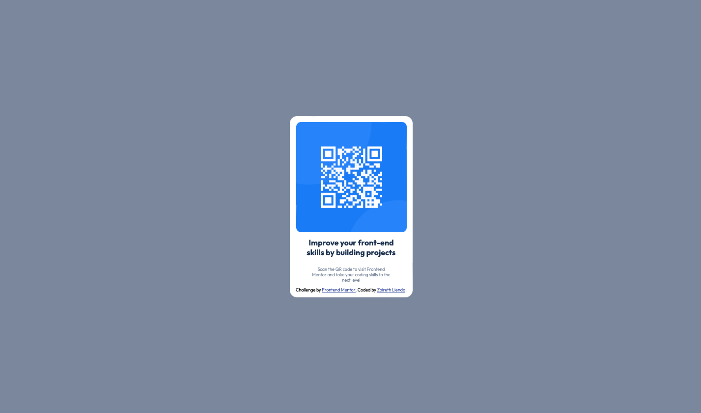

# Frontend Mentor - QR code component solution

This is a solution to the [QR code component challenge on Frontend Mentor](https://www.frontendmentor.io/challenges/qr-code-component-iux_sIO_H). Frontend Mentor challenges help you improve your coding skills by building realistic projects. 

## Table of contents

- [Overview](#overview)
  - [Screenshot](#screenshot)
  - [Links](#links)
- [My process](#my-process)
  - [Built with](#built-with)
  - [What I learned](#what-i-learned)
  - [Continued development](#continued-development)
- [Author](#author)

**Note: Delete this note and update the table of contents based on what sections you keep.**

## Overview

### Screenshot

### Links

- Solution URL: [Add solution URL here](https://your-solution-url.com)
- Live Site URL: [Add live site URL here](https://your-live-site-url.com)

## My Process
### Built with

- CSS custom properties
- Flexbox

### What I learned

- Finally mastered the easy process of importing fonts from Google (it wasn't working for me before because I wasn't choosing the right properties)
- Gained more practice using flexbox.

### Continued development

- Is there a way to pick up the color directly from an image reference? (and I mean... without going to far, like using external apps)It doesn't seem that my background matches the exact color requested. Mental note to review in the future!🧠

## Author

- Website - Zoireth Liendo
- Frontend Mentor - [@zoirethl](https://www.frontendmentor.io/profile/zoirethl)

# QR-Code
# QR-Code
